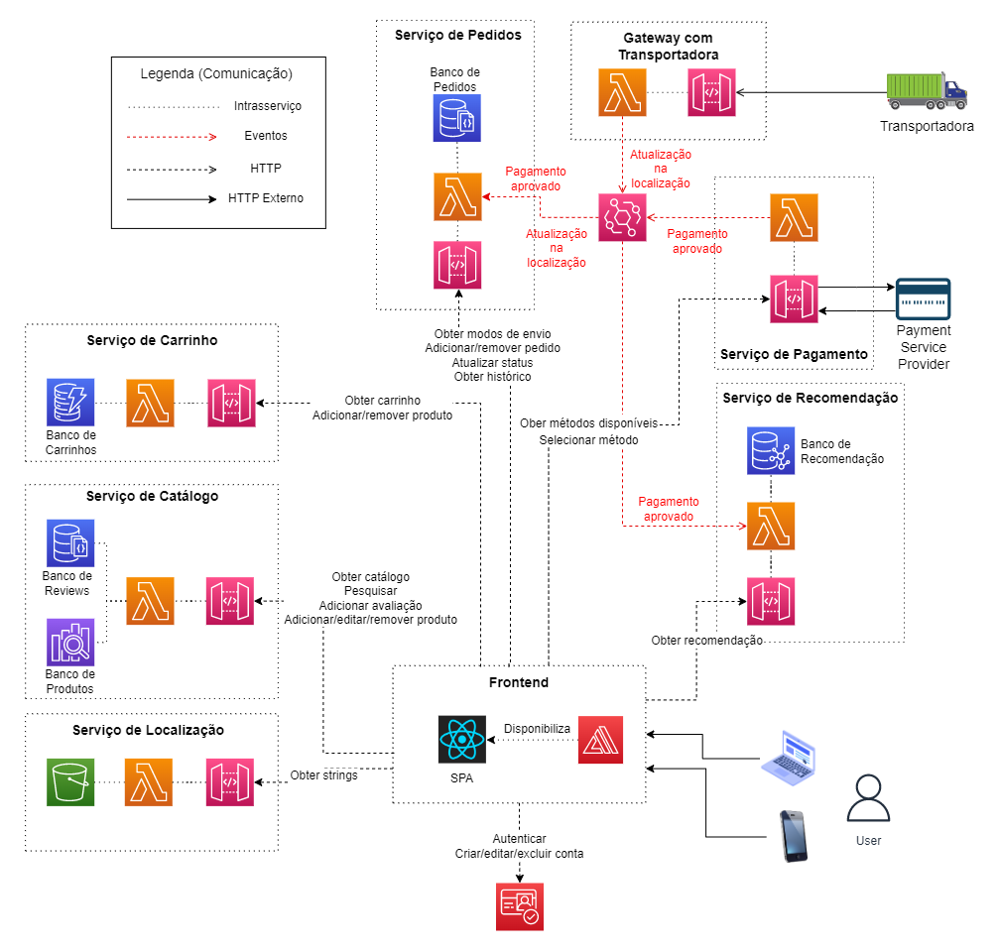

# README
This is the final project of my specialization on Distributed Software Architecture.
bShop is an e-commerce system developed for academic purposes. The diagram below shows the proposed architecture:



Only the following services and features will be implemented:
- Catalog Service: products stored in AWS OpenSearch
  - Feature 'retrieve all products'
  - Feature 'full-text search': use query param `q` to search for products looking at fields `name` (weight 4) and `description` (weight 1)
- Cart Service: users shopping carts stored in AWS DynamoDB (username -> list of products)
  - Feature 'add to cart'
  - Feature 'remove from cart'
  - Feature 'get cart'
  - Feature 'delete cart'
- Recommendation Service: graph database implemented with AWS Neptune where we have users and products nodes and edges represent purchases
  - Feature 'get recommendation': when an user selects a product P, look for other products bought by users who also bought P
- User Service: users stored in AWS Cognito
  - Feature 'login'

Each endpoint in the following table corresponds to a serverless function. `user` is determined based on the ID_TOKEN provided on the Authorization header.
Endpoint            | HTTP method | Description
--------------------|-------------| -----------
catalog/            | GET         | Get products (query params `q`, `size` and `page`)
cart/               | GET         | Get `user` cart
cart/               | POST        | Add product to `user` cart
cart/               | DELETE      | Delete `user` cart
cart/{id}           | DELETE      | Remove product from `user` cart
recommendation/{id} | GET         | Get a list of recommended products
user/login          | POST        | Get `ACCESS_TOKEN`, `ID_TOKEN` and `REFRESH_TOKEN`

The frontend is a Single-Page Application developed with React:
- Home: shows a grid with all products.
- Search results: users are redirected here after performing a full-text search; grid of products similar to Home.
- Product: users are redirected here after selecting a product; shows product description, 'Add to cart' button and a list of recommended products
- Cart: shows list of products in user's cart with 'Remove' buttons
- Login: not logged-in users are redirected here if they try to add a product to cart

## Local testing
Export your AWS credentials:
```bash
export AWS_ACCESS_KEY_ID=<YOUR-ACCESS-KEY>
export AWS_SECRET_ACCESS_KEY=<YOUR-SECRET-KEY>
```

Load CatalogDB with dummy data (`catalog/data/products.bulk`):
```bash
node catalog/load-db.js
```

Search:
```bash
node -e 'require("./catalog/search/index.js").handler({"queryStringParameters":{"size":5,"page":1,"q":"RGB water asdf Intel"}},{"awsRequestId":"local-test"},(cb,res)=>console.log(JSON.stringify(res)))'
```

Get all products:
```bash
node -e 'require("./catalog/search/index.js").handler({"queryStringParameters":{"size":5,"page":1}},{"awsRequestId":"local-test"},(cb,res)=>console.log(JSON.stringify(res)))'
```

Login:
```bash
node -e 'require("./user/scripts/login.js").handler("bruna@gmail.com","a1s2d3f4")'
```

Get cart:
```bash
node -e 'require("./cart/get/index.js").handler({"requestContext":{"authorizer":{"claims":{"cognito:username":"bruna@gmail.com"}}},"headers":{"Authorization":"<ID_TOKEN>"}},{"awsRequestId":"local-test"},(cb,res)=>console.log(JSON.stringify(res)))'
```

Add product to cart:
```bash
node -e 'require("./cart/add/index.js").handler({"body":{"product":{"id":"1","name":"some name","description":"some description","image_url":"some url","price":123.4}},"requestContext":{"authorizer":{"claims":{"cognito:username":"bruna@gmail.com"}}},"headers":{"Authorization":"<ID_TOKEN>"}},{"awsRequestId":"local-test"},(cb,res)=>console.log(JSON.stringify(res)))'
```

Remove product from cart:
```bash
node -e 'require("./cart/remove/index.js").handler({"body":{"product_id":"2"},"requestContext":{"authorizer":{"claims":{"cognito:username":"bruna@gmail.com"}}},"headers":{"Authorization":"<ID_TOKEN>"}},{"awsRequestId":"local-test"},(cb,res)=>console.log(JSON.stringify(res)))'
```

Delete cart:
```bash
node -e 'require("./cart/delete/index.js").handler({"requestContext":{"authorizer":{"claims":{"cognito:username":"bruna@gmail.com"}}},"headers":{"Authorization":"<ID_TOKEN>"}},{"awsRequestId":"local-test"},(cb,res)=>console.log(JSON.stringify(res)))'
```

## Testing with cURL
After the services are deployed to AWS, you can send requests with cURL.

Get cart:
```bash
curl 'https://7pz60grmkj.execute-api.us-east-1.amazonaws.com/test/cart' -H 'Authorization: <ID_TOKEN>'
```

Add to cart:
```bash
curl -X POST 'https://7pz60grmkj.execute-api.us-east-1.amazonaws.com/test/cart' -d '{"product":{"id":"2","name":"another name","description":"another description","image_url":"another url","price":124}}' -H 'Content-type: application/json' -H 'Authorization: <ID_TOKEN>'
```

Searching for products:
```bash
curl 'https://7pz60grmkj.execute-api.us-east-1.amazonaws.com/test/catalog/search?q=rgb%20intel%20water%20proof'
```
